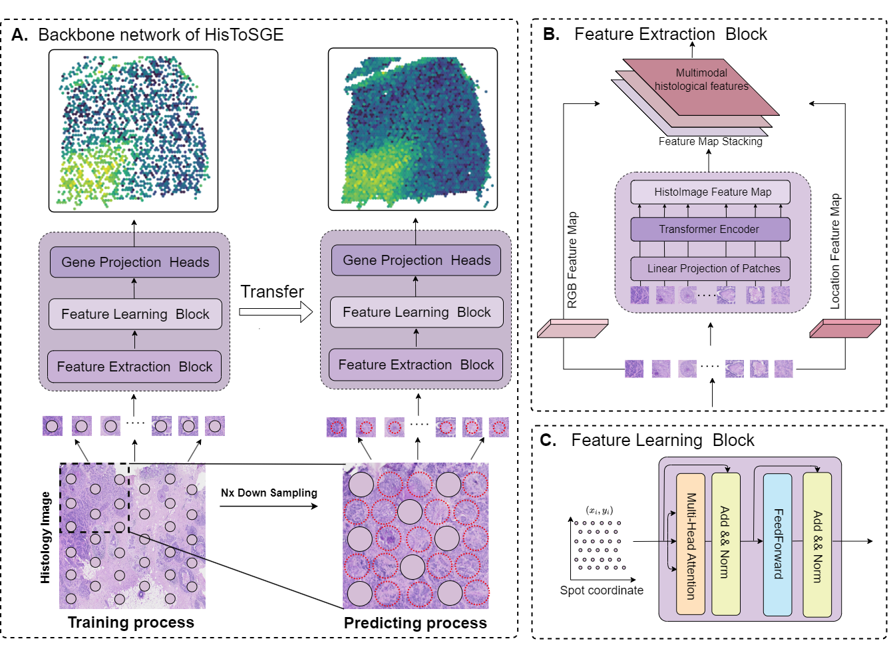

# High-Resolution Spatial Transcriptomics Using Histology Images with HisToSGE

In this study, we developed HisToSGE. This method integrates histological image information, spatial information, and gene expression data to robustly generate high-resolution gene expression profiles in ST. HisToSGE comprises two main modules: the feature extraction module and the feature learning module. The feature extraction module, utilizing the UNI \cite{UNI} model trained on one hundred million histological images, generates multimodal feature maps that include RGB, positional, and histological features. The feature learning module employs a multi-head attention mechanism to integrate spot coordinates and learn features from these multimodal maps, thereby enhancing feature representation. We evaluated HisToSGE using four datasets and compared its performance with five existing methods. Our results demonstrate that HisToSGE can accurately generate high-resolution gene expression profiles, enhance gene expression patterns, and preserve the original gene expression spatial structure.

## System environment
Required package:
- PyTorch >= 2.2.0
- scanpy >= 1.8
- python >=3.10

## Datasets
Four publicly available ST datasets were used in this study.
-  DLPFC dataset consists of 12 sections of the dorsolateral prefrontal cortex (DLPFC) sampled from three individuals. The number of spots for each section ranges from 3498 to 4789. The original authors have manually annotated the areas of the DLPFC layers and white matter. The datasets are available in the spatialLIBD package from http://spatial.libd.org/spatialLIBD.
-  MouseBrain dataset includes a coronal brain section sample from an adult mouse, with 2903 sampled spots. The datasets are available in https://cf.10xgenomics.com/samples/spatial-exp/1.1.0/V1_Adult_Mouse_Brain/V1_Adult_Mouse_Brain_web_summary.html.
-  Human Breast Cancer1 (BC1) dataset includes a fresh frozen invasive ductal carcinoma breast tissue section sample, with 3813 sampled spots. The datasets are available in https://www.10xgenomics.com/datasets/human-breast-cancer-block-a-section-1-1-standard-1-0-0.
-  Human Breast Cancer2 (BC2) dataset includes a formalin-fixed invasive breast carcinoma tissue section sample, with 2518 sampled spots. The datasets are available in https://www.10xgenomics.com/datasets/human-breast-cancer-ductal-carcinoma-in-situ-invasive-carcinoma-ffpe-1-standard-1-3-0

## HisToSGE pipeline
- Install the UNI module form https://github.com/mahmoodlab/UNI.
- Run `train.py`
- Run `test.py`

